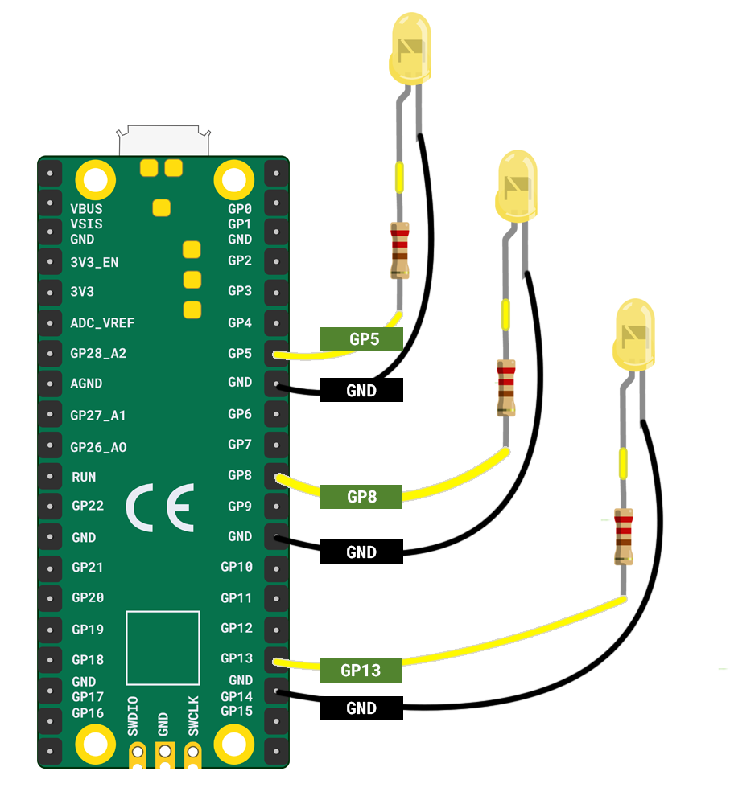

Je hebt nodig:

+ Een Raspberry Pi Pico
+ Meerdere LED's in een kleur naar keuze
+ Genoeg weerstanden voor elke LED
+ Genoeg bus-bus verbindingsdraden voor elke LED

**Opmerking:** Het **positieve** (lange) been van elke LED moet een weerstand hebben. Je moet ook verbindingsdraden aan beide benen bevestigen.

Het diagram hieronder toont **drie** enkele LEDs verbonden aan een Raspberry Pi Pico.

+ Bevestig LED 1 aan **GP13** en de dichtstbijzijnde **GND** -pin
+ Bevestig LED 2 aan **GP8** en de dichtstbijzijnde **GND** -pin
+ Bevestig LED 3 aan **GP5** en de dichtstbijzijnde **GND** -pin

***
Dit project werd vertaald door vrijwilligers:

[name]

[name]

[name]

Dankzij vrijwilligers kunnen we mensen over de hele wereld de kans geven om in hun eigen taal te leren. Jij kunt ons helpen meer mensen te bereiken door vrijwillig te starten met vertalen - meer informatie op [rpf.io/translate](https://rpf.io/translate).
